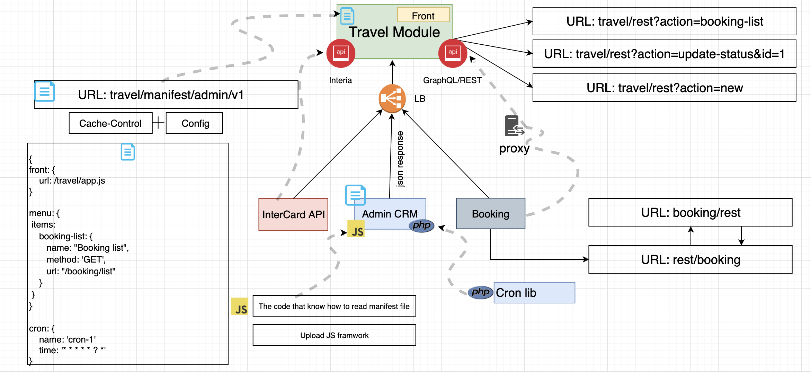
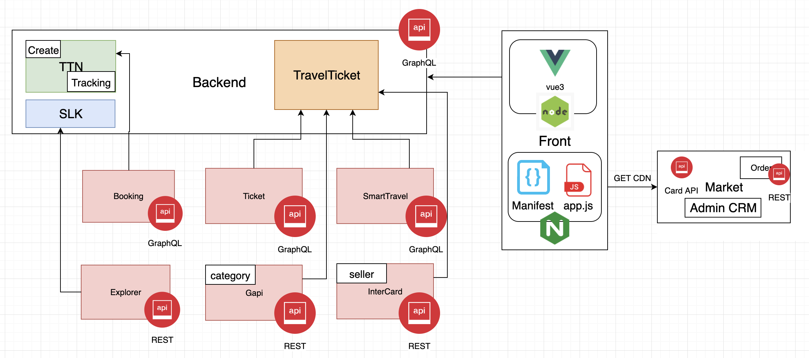

# Architecture



The main idea is separate development between different teams.
Example: we have a microservices architecture in which each module is independent and must be configured somehow. 
And we want to have one entry point for configuration. 

Solution: We make one entry point (Admin CRM) for configuration under a separate domain (http://admin.com).
Each team is developing self application (app.js) with self (routes, crones, jobs) and describe it on the file (manifest.json) in the self repositories. 
The role of admin CRM is read manifest.json parsing it and integrate in web page.



## Components

* [Delivery Travel](code/src/Components/TicketTravel/README.md)
* [TTN](code/src/Components/TTN/README.md)

## Layered

To make the code organised each module uses Layered Architecture and each functional area is divided on four layers:

* `Application`
* `Doman`
* `Infrastructure`
* `UI`

## Stack

* PHP 8.1
* Symfony 6.0 
* RabbitMQ
* GraphQL
* Kubernetes
* Vue 3.0

## Docker Install 

### Native Docker for MAC

1. Install the stable version [docker for MAC](https://docs.docker.com/docker-for-mac/install/#download-docker-for-mac)

### Docker for Ubuntu (20.04 LTS)

1. [Install docker-engine](https://docs.docker.com/engine/installation/linux/ubuntu/)
2. [Manage Docker as a non-root user](https://docs.docker.com/engine/installation/linux/linux-postinstall/)
3. [Install docker-compose (Version 1.6.2)](https://docs.docker.com/compose/install/)

## Project Install

* Run `make install`
* Add docker machine IP to /etc/hosts

## Available hosts

* Travel: [https://market.travel.docker](https://market.travel.docker)

### Hosts configuration 

**GNU/Linux platform**
```
0.0.0.0    market.travel.docker
```
**Mac OS X platform**
```
127.0.0.1     market.travel.docker
```

# Documentation
1[Issues](/docs/issue.md)
2[xDebug](/docs/xdebug.md)
