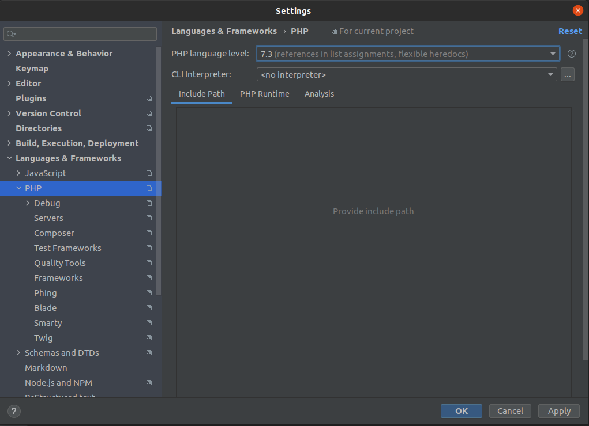
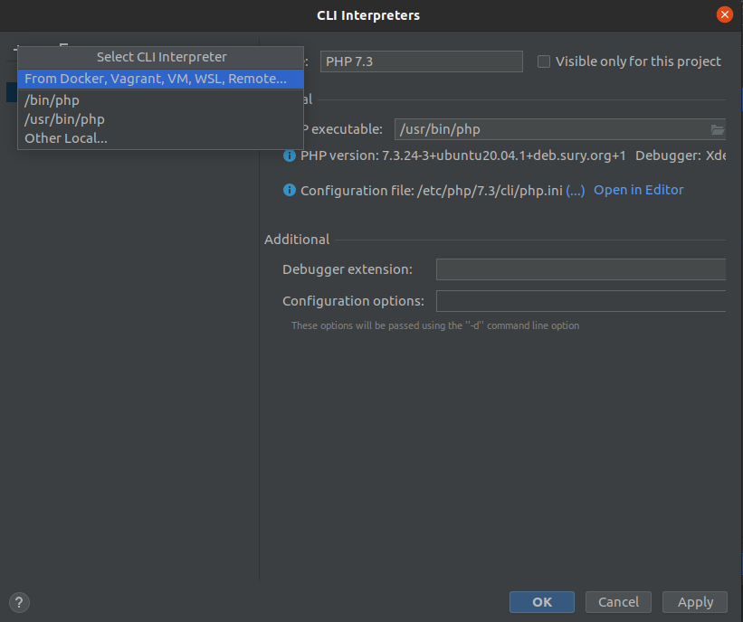
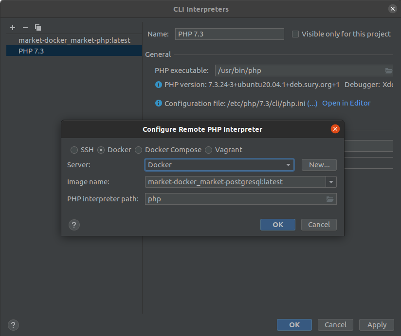
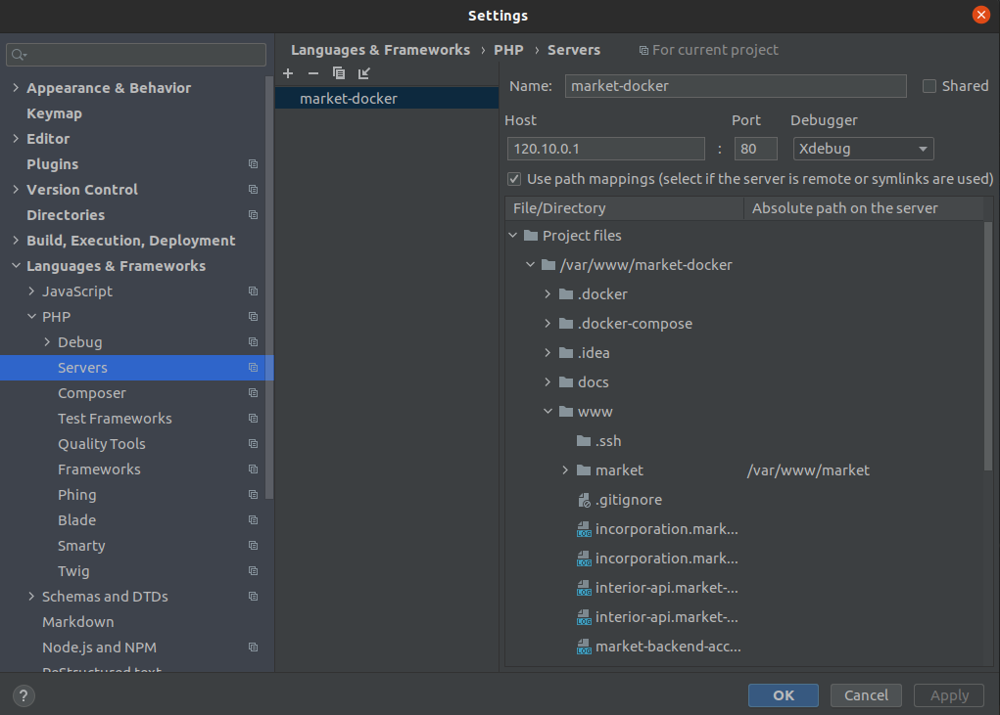
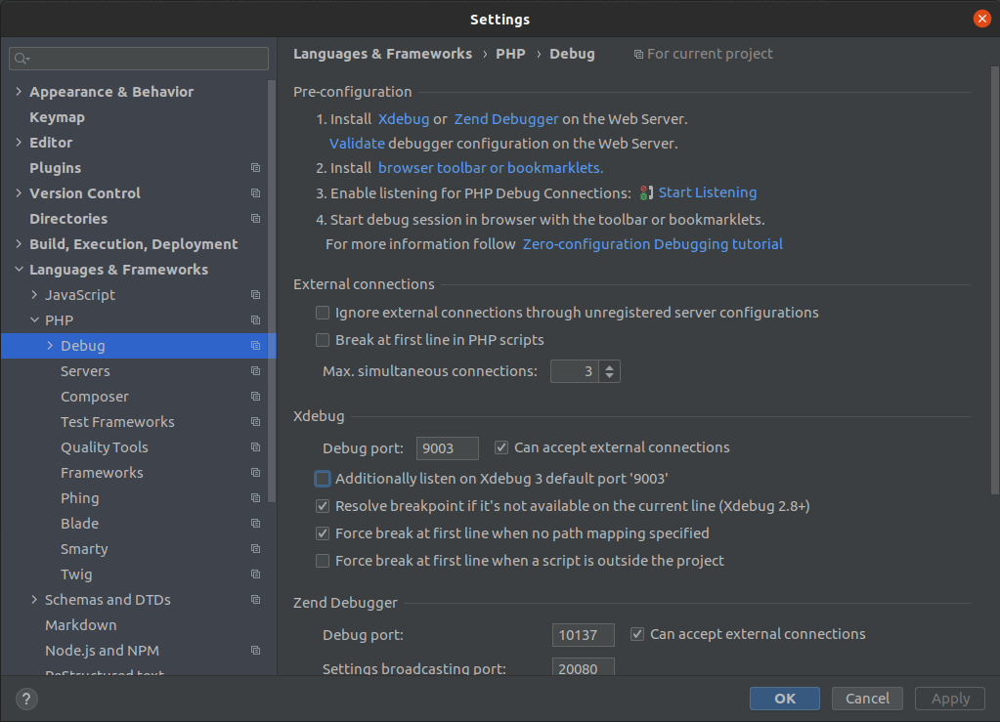
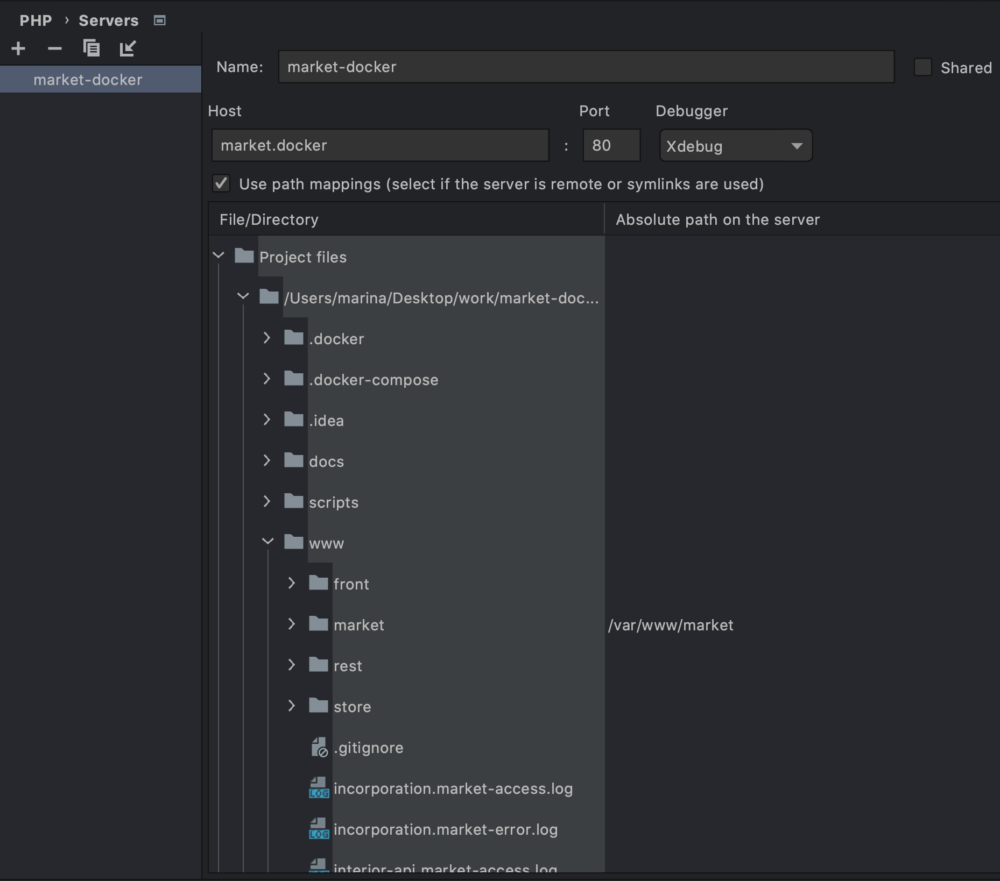
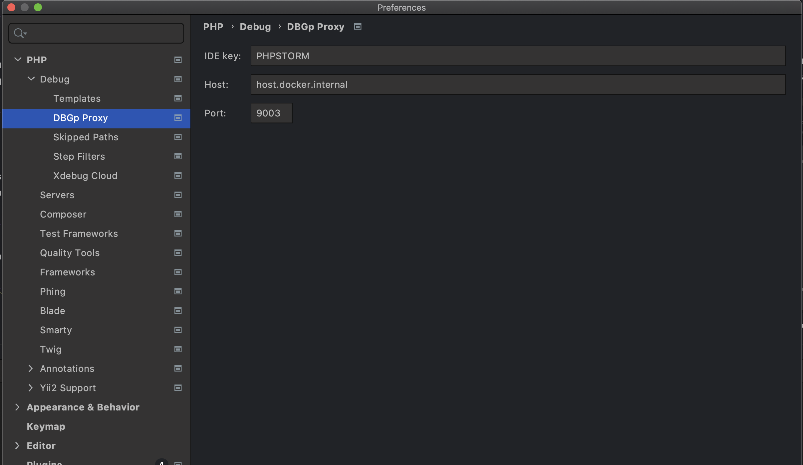

## Настройка xdebug
**GNU/Linux platform**
1. Добавляем в IDE php интерпретатор с docker контейнера. Открываем
   **Settings > Languages and Frameworks > PHP** и в строке **CLI
   Interpreter** нажимаем на кнопку **...**

   

2. Добавляем новый интерпретатор через нажатие на **+** и выбор **From
   docker...**

   

3. Выбираем **Docker** и нажимаем **OK**

   

4. Перейти в **Settings > Servers** и добавить `market.travel.docker`. Также
   обратите внимание на **Path mapping**

   

5. По умолчанию xdebug настроен на 9003 порт,
   устанавливаем это значение в **Debug port** на странице настроек
   **Settings > Languages and Frameworks > PHP > Debug**

   

**Mac OS X platform**
1. Выполнить пункты 1, 2, 3, 5 настройки для GNU/Linux
2. Перейти в **Settings > Servers** и добавить `market.travel.docker`. Также
   обратите внимание на **Path mapping**
   
   
   
3. Перейти в **Preferences > PHP > Debug > DBGp Proxy**

   